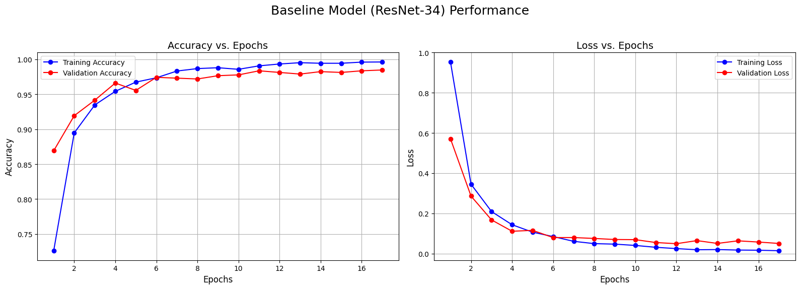
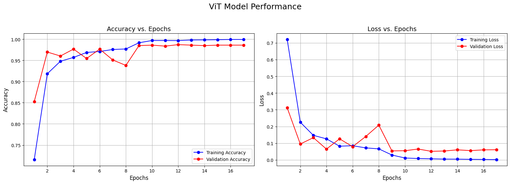
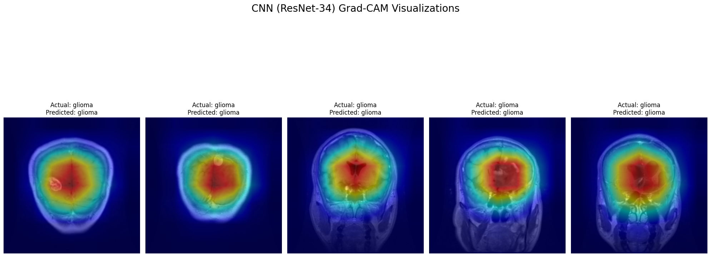
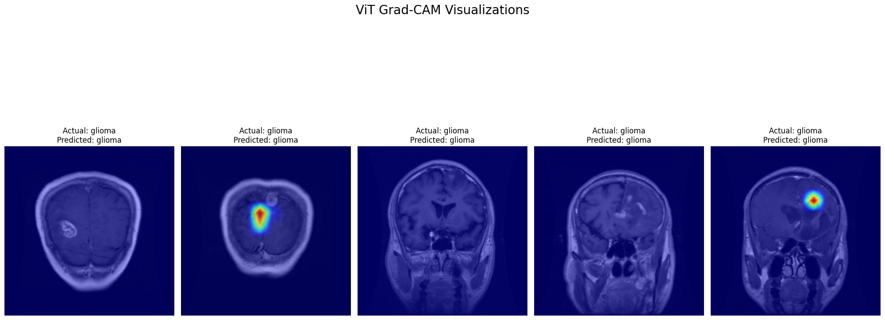

# Brain Tumor Classification using Deep Learning: A Comparative Study of CNNs and Vision Transformers

## Project Overview

This project implements and evaluates a deep learning pipeline for classifying brain tumors from MRI scans. It compares the performance, interpretability, and robustness of a classic Convolutional Neural Network (CNN) against a modern Vision Transformer (ViT) architecture. The entire project is implemented in a Google Colab notebook using PyTorch and other open-source libraries.

---

## Dataset Used

This project utilizes the **Brain Tumor MRI Dataset** available on Kaggle.

- **Source:** [Kaggle Link](https://www.kaggle.com/datasets/masoudnickparvar/brain-tumor-mri-dataset)
- **Total Images:** 7,023
- **Image Format:** JPEG
- **Classes:** 4 categories
    - `glioma`
    - `meningioma`
    - `notumor` (no tumor)
    - `pituitary`
- **Structure:** The data is pre-organized into `Training` and `Testing` directories, which are further subdivided by class, making it suitable for standard supervised learning tasks.

---

## Key Features

- **Two Architectures:**
    1.  **Baseline CNN:** A fine-tuned ResNet-34 model.
    2.  **Transformer:** A fine-tuned Vision Transformer (ViT-Base).
- **Rigorous Evaluation:** Performance is measured using accuracy, F1-score, and ROC-AUC.
- **Interpretability Analysis:** Grad-CAM visualizations are used to understand and compare *how* each model makes its predictions.
- **Robustness Testing:** Models are challenged with synthetically corrupted data (noise, brightness shifts) to assess their real-world reliability.
- **Reproducibility:** The project is structured in a Colab notebook with clear, sequential cells. Final trained models are saved.

---

## Final Results Summary

This table summarizes the key performance metrics for the two final models on the unseen test set.

| Metric                        | CNN (ResNet-34)            | Vision Transformer (ViT)     |
| ----------------------------- | -------------------------- | ---------------------------- |
| **Base Accuracy**             | 98.86%                     | **99.31%**                   |
| **Base F1-Score (Macro)**     | 0.988                      | **0.993**                    |
| **Accuracy (Gaussian Noise)** | 93.36% (↓ 5.5%)            | **99.39%** (Slight change)       |
| **Accuracy (Brightness Shift)** | **98.47%** (↓ 0.4%)          | 96.49% (↓ 2.8%)              |
| **Interpretability (Grad-CAM)** | Broad, diffuse activation  | **Highly localized & precise** |

### Key Insights:
- The **Vision Transformer** achieved slightly higher overall accuracy and demonstrated superior, highly-focused interpretability.
- The **ViT** was exceptionally **robust to noise**, a significant advantage for medical imaging.
- The **CNN** was more **robust to changes in brightness/contrast**, showcasing the invariance of its learned features.

---

## Visualizations

### 1. Model Learning Curves

### 2. Interpretability with Grad-CAM

The Grad-CAM heatmaps reveal a key difference in how the models "see" the tumors.

**CNN (ResNet-34): Broad, contextual focus.**

**ViT: Precise, localized attention on the tumor.**

---

## How to Run This Project

1.  **Setup (Cell 0):** Mount Google Drive and install required libraries like `timm` and `pytorch-grad-cam`.
2.  **Dataset (Cell 1):** Add your `kaggle.json` API key to Google Drive to download the dataset automatically.
3.  **Preprocessing (Cells 2-3):** Run the cells to prepare the data and create PyTorch DataLoaders.
4.  **Training (Cells 4-5):** Run the training scripts for the baseline CNN and the ViT. This will generate the `.pth` model files.
5.  **Analysis (Cells 5a, 5b, 7, 8):** Run the subsequent cells to generate performance plots, Grad-CAM visualizations, and robustness reports.
6.  **Saving & Inference (Cell 10):** This cell saves the final models to your Google Drive and contains an optional interactive demo to test with your own images.